# Grokking Operators

This project studies grokking in transformers on modular arithmetic tasks, with emphasis on mechanistic structure in internal representations (Fourier-like neurons, pair phase portraits, attention patterns, and error collapse).

## Tasks

- `train_addition.py`: learn `(a + b) mod p`
- `train_addpow.py`: learn `((a + b) ** c) mod p`
- `add_three.py`: learn `(a + b + c) mod p`

Default prime is `p=97`.

## Current HPC Run Snapshot (`runs_hpcrun`)

- `addition_p97`: solved (`Full-table accuracy: 1.0`)
- `addpow_p97_cmax32_tf0.2_wd0.1`: solved across probed `c` values (`accuracy_by_c.txt` all `1.0`)
- `add3_p97_tf0.3_wd0.1`: not grokked yet; accuracy remains around `~0.30` across `c`, but produces rich/chaotic internal geometry

## Why These Neurons Were Chosen

Neuron selection is Fourier-driven, not random:

- For a structured path (for example `a=0..p-1, b=0`), collect FFN activations per neuron.
- Compute FFT magnitude per neuron along the path.
- Score each neuron by dominant non-DC Fourier peak energy (and track phase/purity).
- Select top neurons by this Fourier peak score.

Why this helps:

- It prioritizes neurons with strong periodic structure tied to modular arithmetic.
- It avoids picking neurons that only have large variance but weak harmonic content.
- It produces cleaner circuit-like traces and pairwise phase portraits.

## Key Visual Results

## AddThree (`runs_hpcrun/add3_p97_tf0.3_wd0.1/viz`)

`add_three` has not grokked yet in this run, and its behavior is much more chaotic than `addition` / `addpow`.  
Even so, it generates very strong transformer-mechanistic visuals.
Result summary: `accuracy_by_c.txt` stays around `~0.30` for most `c`.

### Images 10, 11, 12 (side by side)

| Image 10 | Image 11 | Image 12 |
|---|---|---|
| 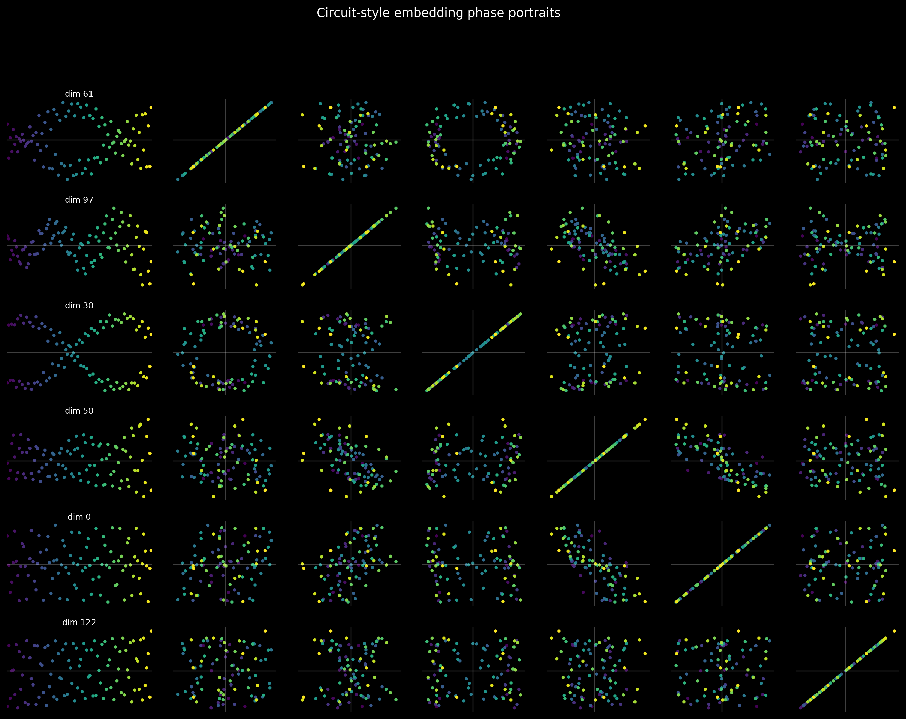 | 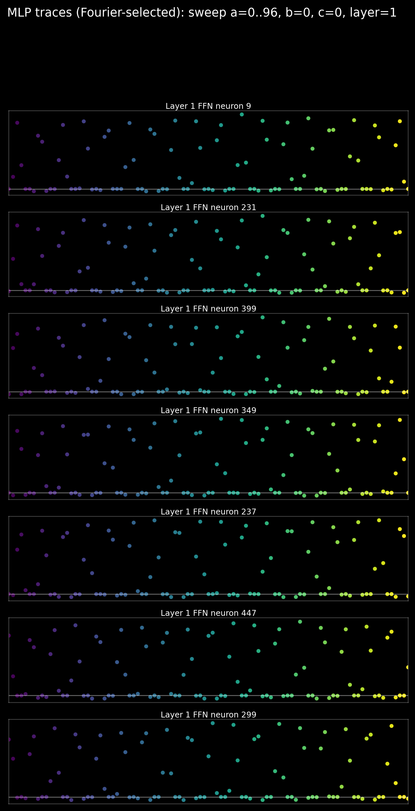 | 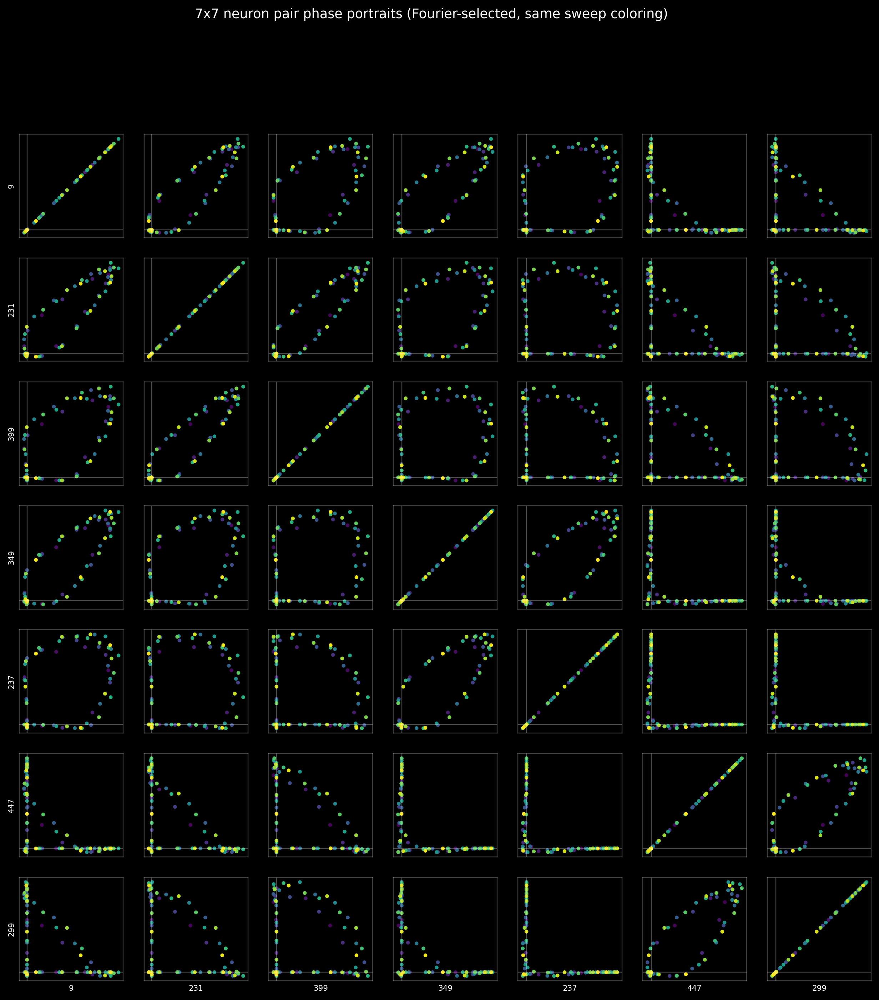 |

### Error structure

| c=0 | c=48 | c=96 |
|---|---|---|
| 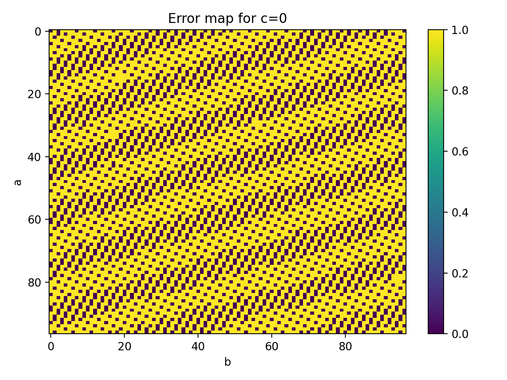 | 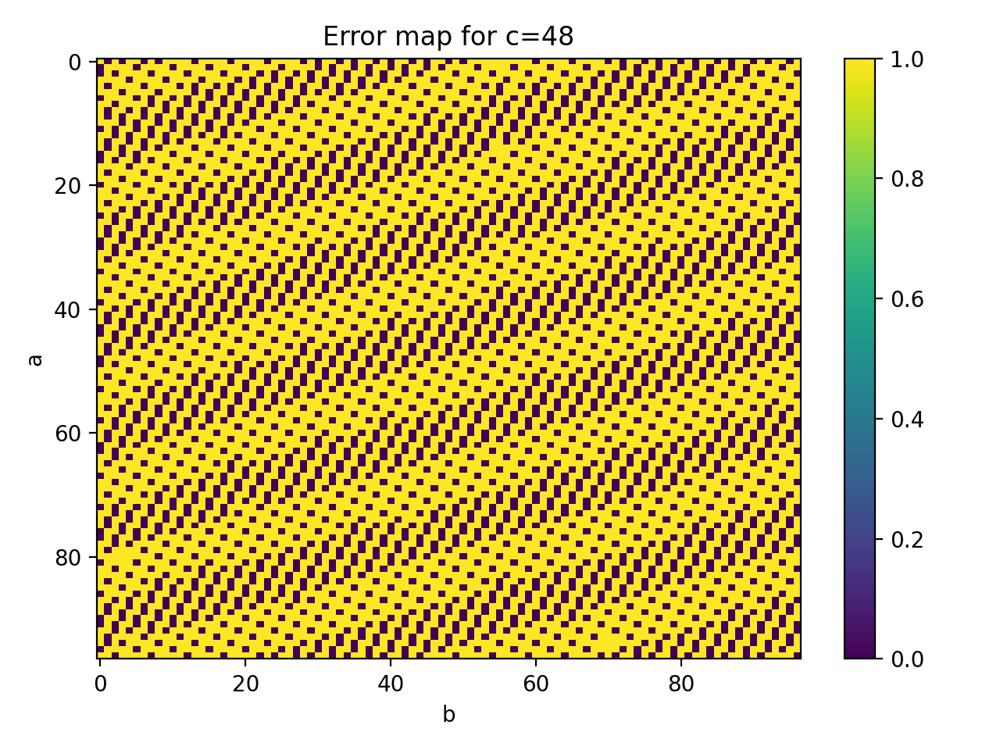 |  |

## Addition (`runs_hpcrun/addition_p97/viz`)

Note: `addition` images 10/11/12 are different plot families (attention example, Fourier circles, embedding gallery).
Result summary: `Full-table accuracy = 1.000000`.

### Images 12, 13, 14 (side by side)

| Image 12 | Image 13 | Image 14 |
|---|---|---|
| 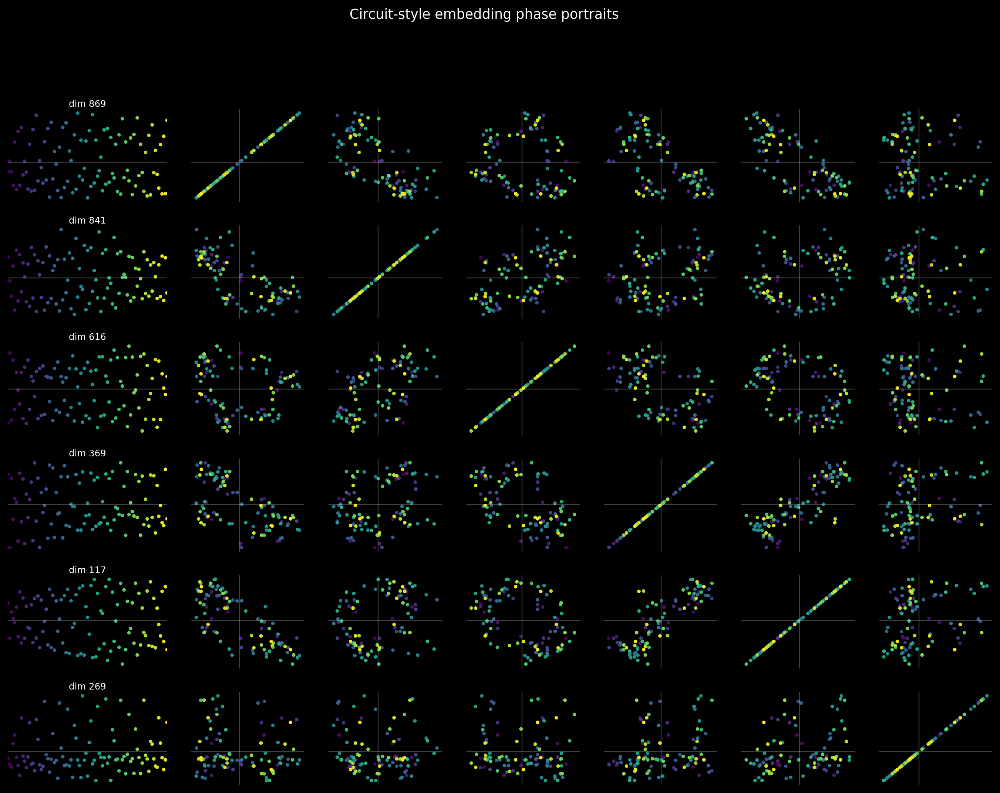 | 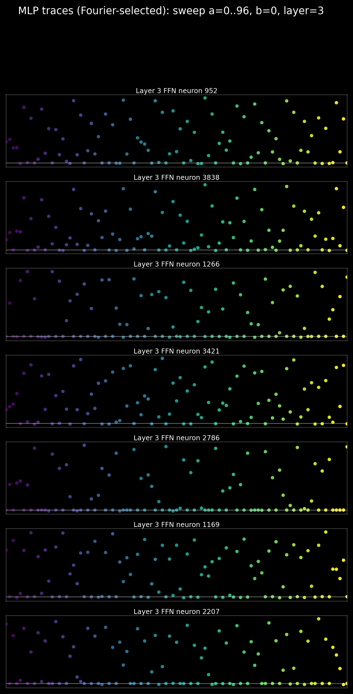 |  |

### Error structure

| Error map |
|---|
| 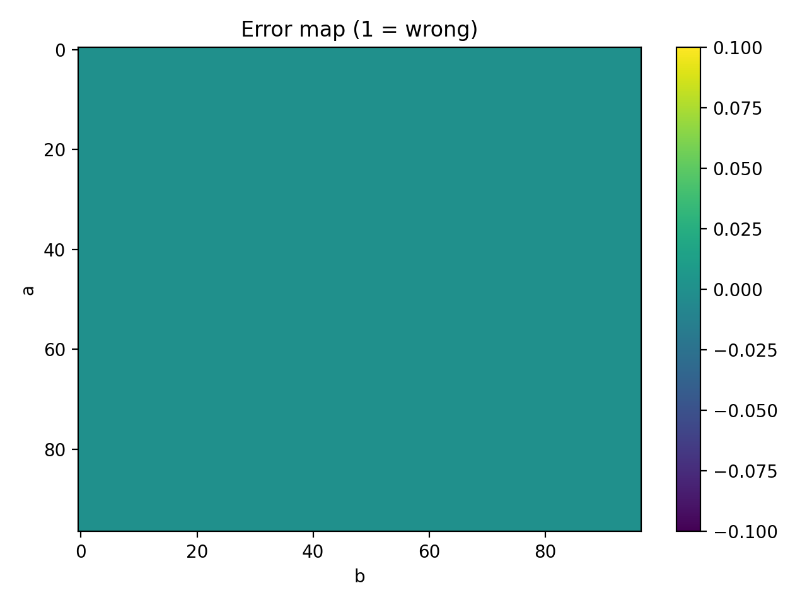 |

## AddPow (`runs_hpcrun/addpow_p97_cmax32_tf0.2_wd0.1/viz`)
Result summary: `accuracy_by_c.txt` is `1.000000` for all shown `c=0..32`.

### Images 10, 11, 12 (side by side)

| Image 10 | Image 11 | Image 12 |
|---|---|---|
| 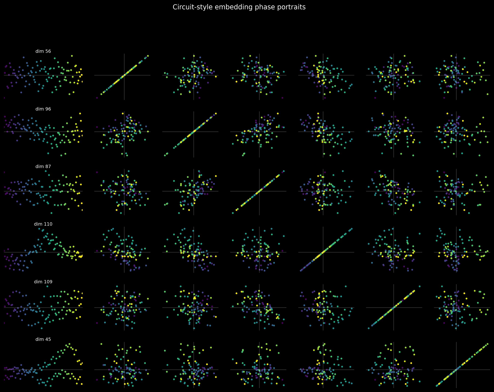 | 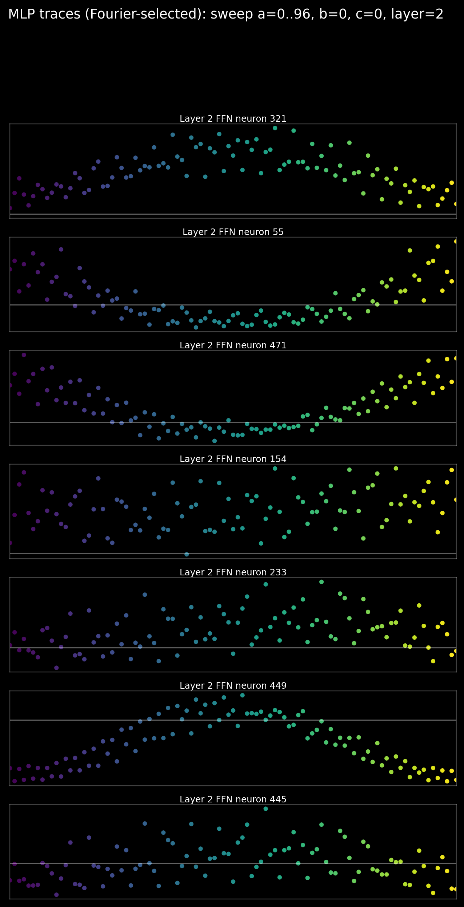 | 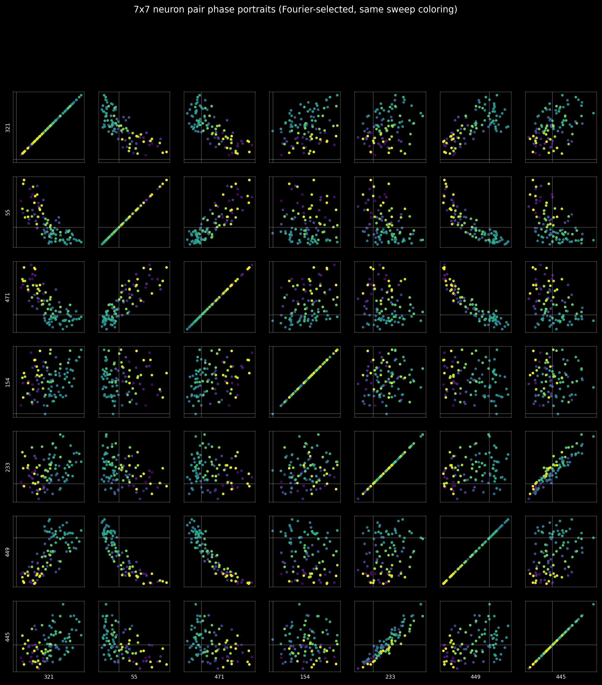 |

### Error structure

| c=0 | c=32 |
|---|---|
| 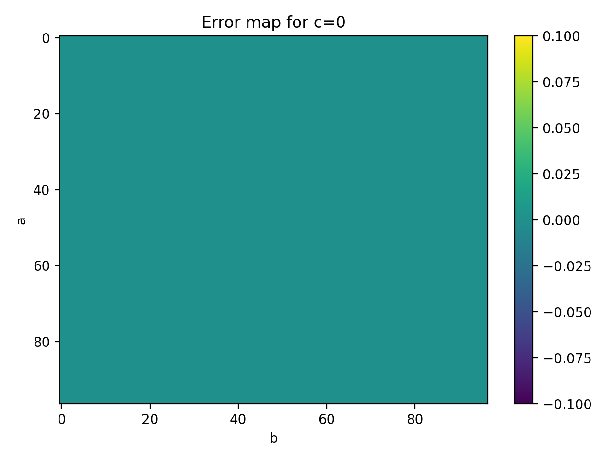 | 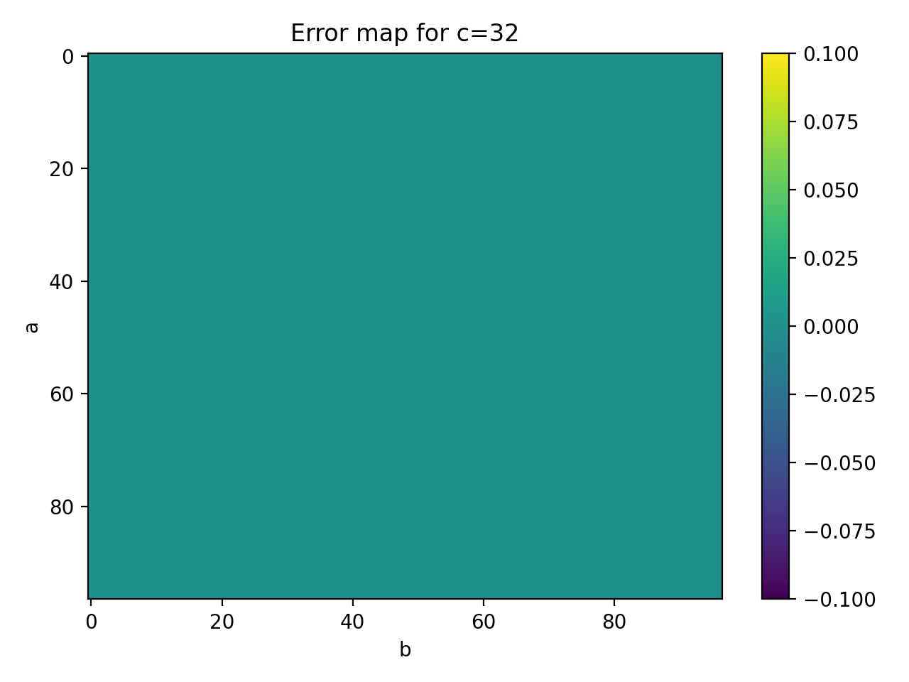 |

## Running

## Local

```bash
python -m venv .venv
source .venv/bin/activate
pip install -r requirements.txt

python train_addition.py
python viz_addition.py
python viz_advanced_addition.py
```

## HPC (Slurm)

Use scripts in `sbatch/`, for example:

```bash
sbatch sbatch/train_addition.sbatch
sbatch sbatch/train_addpow.sbatch
sbatch sbatch/add_three.sbatch

sbatch sbatch/viz_addition.sbatch
sbatch sbatch/viz_addpow.sbatch
sbatch sbatch/viz_add_three.sbatch
sbatch sbatch/viz_advanced_addition.sbatch
```

Autoloop scripts are also available for long multi-job chaining with checkpoint resume and stop markers.
